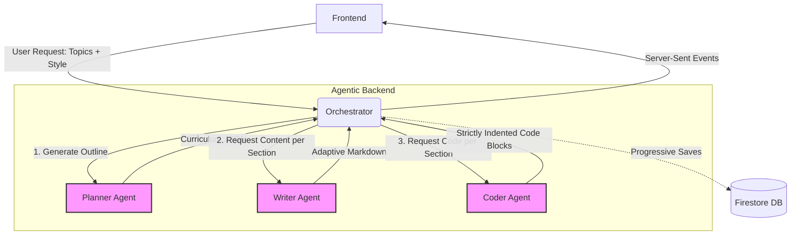

# DSA Learning Guide Generator

A full-stack application that generates comprehensive, AI-powered study guides for Data Structures & Algorithms topics. Select your topics, choose a learning style, and receive a streamed step-by-step guide in real-time.

Powered by the **Antigravity SDK** alongside **Gemini models** to orchestrate the dynamic multi-agent generation pipeline. Persistent storage and history tracking are handled natively via **Google Cloud Firestore**.

## Architecture

- **Frontend**: Vite + Vanilla JS
- **Backend**: FastAPI + Google Antigravity SDK — Multi-agent pipeline (Planner → Writer → Coder)

## GCP Firestore Setup

The application saves generated guides to Google Cloud Firestore (NoSQL Document DB) to provide a persistent "History" view.

### 1. In Google Cloud Console (`console.cloud.google.com`)
1. Create a new Project (or select an existing one).
2. Go to **Firestore** and click **Create Database**.
3. Select **Native mode** and choose a region close to you.
4. Go to **IAM & Admin > Service Accounts**.
5. Create a new Service Account and grant it the **Cloud Datastore User** role (or Owner/Editor for local dev).
6. Click on the Service Account > **Keys** > **Add Key** > **Create new key** (JSON format).
7. Download the `.json` file to your computer.

### 2. In the Repository
1. Move the downloaded `.json` key into the `backend/` directory and rename it to `service-account.json`. (It is already ignored by `.gitignore` so it won't be pushed to GitHub).
2. Update your `backend/.env` file to point to this key:
   ```env
   GOOGLE_APPLICATION_CREDENTIALS="service-account.json"
   ```

## Quick Start

### 1. Setup Environment Variables
Copy the example environment file and add your credentials:
```bash
cp backend/.env.example backend/.env
```
Edit `backend/.env` to include your `GEMINI_API_KEY`, `GOOGLE_APPLICATION_CREDENTIALS`, and `GCP_FIRESTORE_DATABASE`.

### 2. Install Dependencies
Run the unified installation script from the root of the project to set up both the Python backend and the Node.js frontend:
```bash
./install.sh
```

### 3. Start the Application
Run the unified startup script from the root of the project to start both the FastAPI server and the Vite development server simultaneously:
```bash
./start.sh
```

Open [http://localhost:5173](http://localhost:5173) in your browser.

## How It Works

1. **Select Topics** — Pick from 23 DSA topics (Arrays, Trees, DP, etc.)
2. **Choose Style** — Interview Prep, Academic, Visual/Intuitive, or Speed Run
3. **Generate** — A 3-stage AI pipeline creates your guide in real-time.

### Multi-Agent Pipeline

